# DocMind Architecture Documentation

## Overview

DocMind is a desktop AI application for working with Word documents, built with C#/.NET 10 and Avalonia UI. This document describes the proposed modular architecture with improved dependency injection, repository pattern, and configuration management.

## System Architecture Diagram

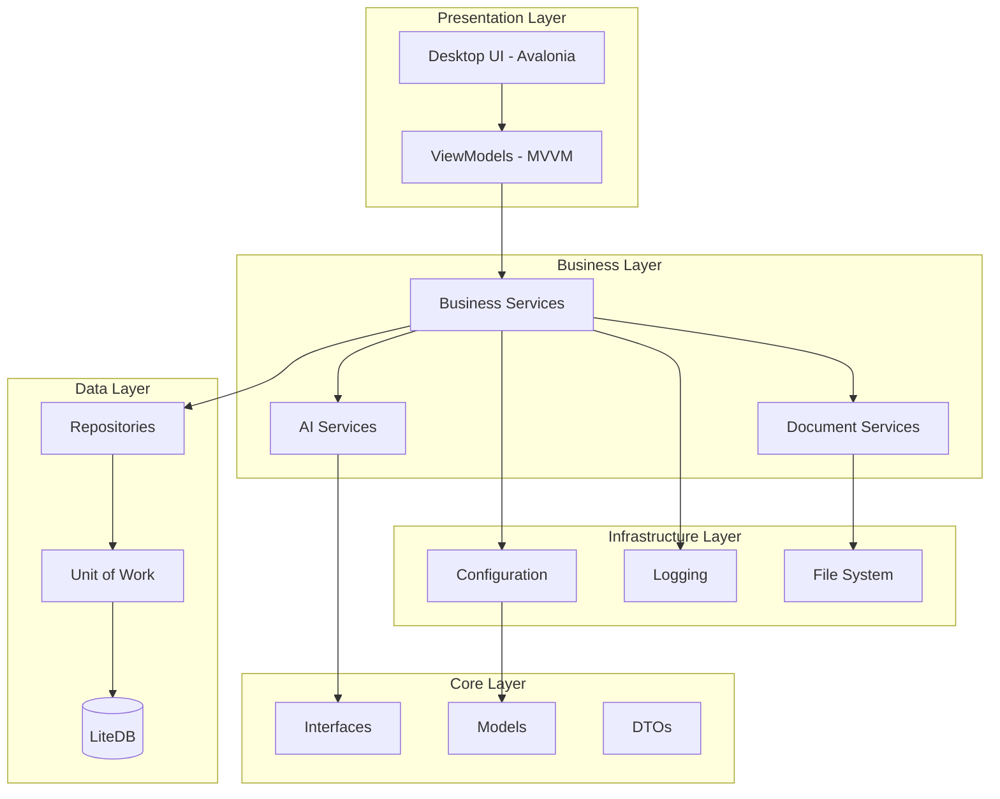

## Layer Responsibilities

### 1. Presentation Layer (DocMind.Desktop)
- **Avalonia UI**: Cross-platform desktop UI framework
- **MVVM Pattern**: ViewModels with CommunityToolkit.Mvvm
- **Views**: XAML-based user interfaces
- **Converters & Behaviors**: UI-specific logic

### 2. Business Layer (DocMind.Services)
- **Document Services**: Word document processing, parsing, validation
- **AI Services**: LLamaSharp integration, prompt management, AI pipelines
- **Cache Services**: Document caching and retrieval
- **History Services**: Query history tracking
- **Validation Services**: Business rule validation

### 3. Data Layer (DocMind.Data)
- **Repositories**: Data access abstraction
- **Unit of Work**: Transaction management
- **Entities**: Database entity definitions
- **Contexts**: Database connection management
- **Migrations**: Database schema evolution

### 4. Infrastructure Layer (DocMind.Infrastructure)
- **Configuration**: App settings management
- **Logging**: Structured logging with Serilog
- **File System**: File operations abstraction
- **External APIs**: Third-party service clients

### 5. Core Layer (DocMind.Core)
- **Interfaces**: Service contracts and abstractions
- **Models**: Domain models and entities
- **DTOs**: Data transfer objects
- **Enums & Constants**: Application constants

## Component Interaction Diagram

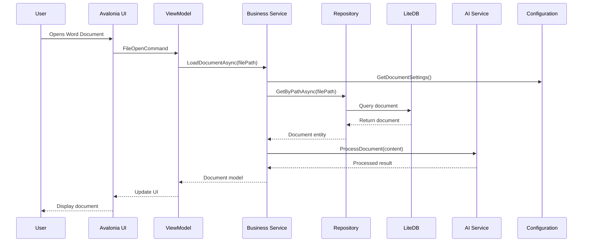

## Dependency Injection Flow

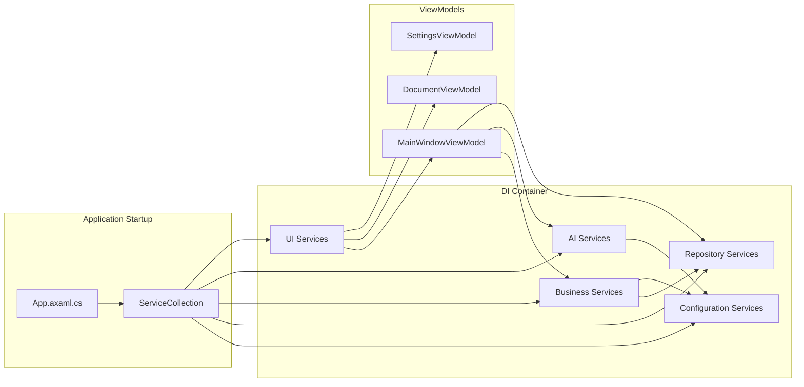

## Data Flow Architecture

### Document Processing Pipeline

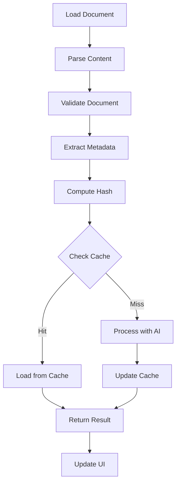

### AI Service Pipeline

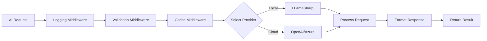

## Configuration Management Architecture

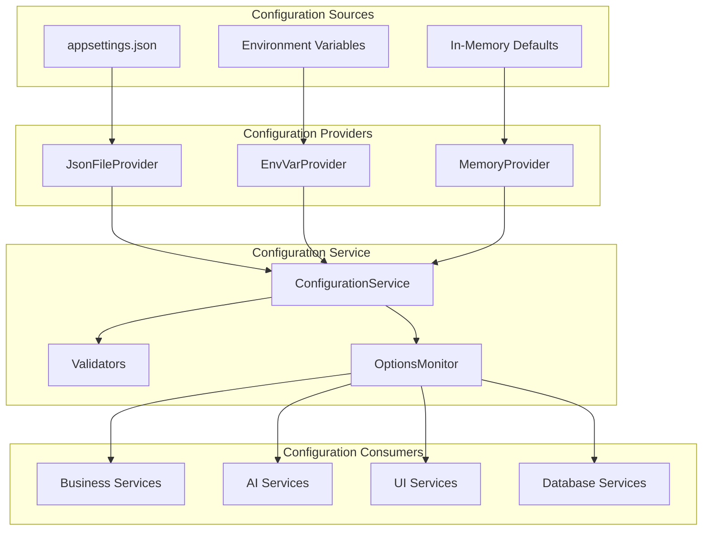

## Repository Pattern Architecture

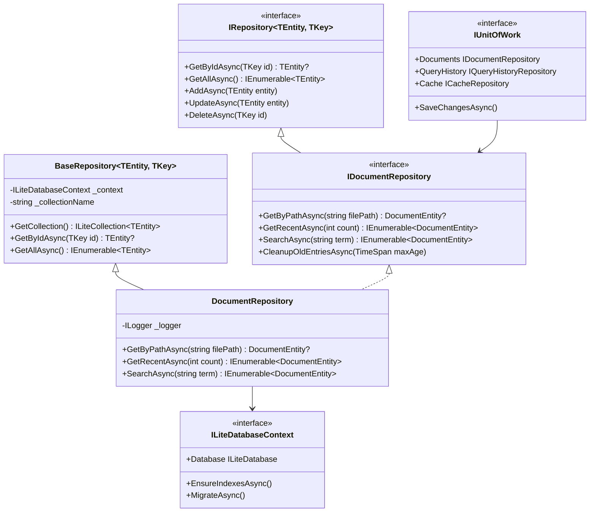

## Service Layer Architecture

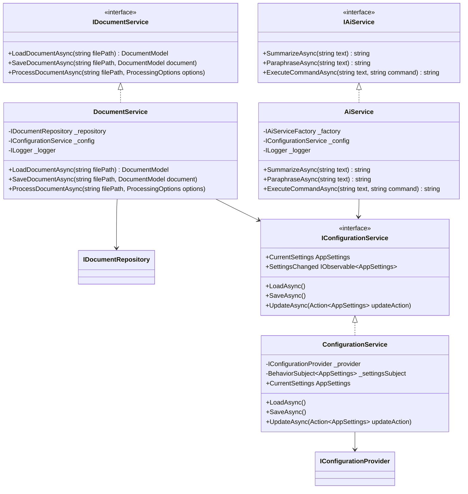

## Deployment Architecture

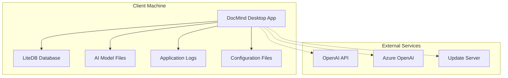

## Security Architecture

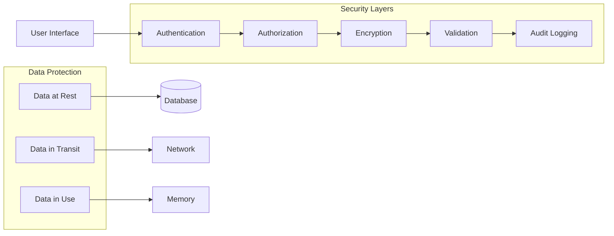

## Monitoring and Observability

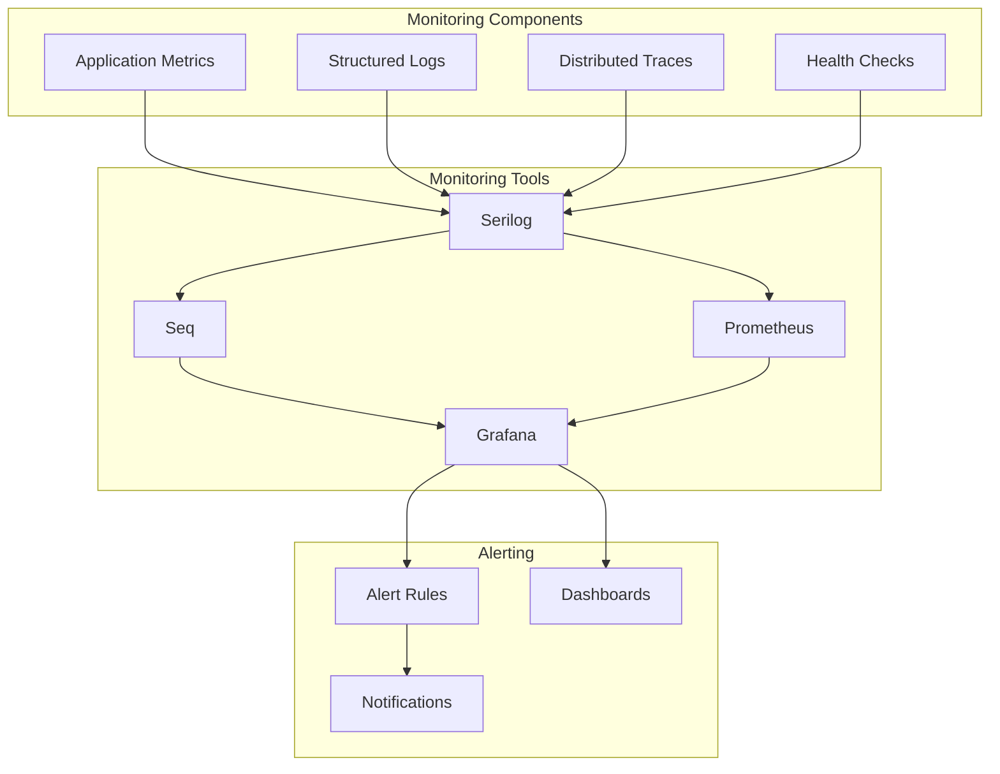

## Implementation Roadmap

### Phase 1: Foundation
1. Create new project structure with layered architecture
2. Implement configuration management system
3. Set up dependency injection container
4. Implement repository pattern for data access

### Phase 2: Core Services
1. Refactor document services with new architecture
2. Implement enhanced AI service with strategy pattern
3. Add comprehensive logging and error handling
4. Implement caching service with multi-level support

### Phase 3: UI Enhancement
1. Refactor ViewModels with proper dependency injection
2. Implement reactive configuration updates in UI
3. Add settings management UI
4. Implement document history and search features

### Phase 4: Advanced Features
1. Add support for multiple document formats
2. Implement AI pipeline with middleware
3. Add offline/online synchronization
4. Implement advanced search and filtering

### Phase 5: Optimization
1. Performance optimization and profiling
2. Memory usage optimization
3. Database query optimization
4. UI responsiveness improvements

## Technology Stack

| Layer | Technology | Purpose |
|-------|------------|---------|
| **UI Framework** | Avalonia UI 11.3 | Cross-platform desktop UI |
| **MVVM Framework** | CommunityToolkit.Mvvm 8.2 | MVVM pattern implementation |
| **Dependency Injection** | Microsoft.Extensions.DI 10.0 | Service registration and resolution |
| **Database** | LiteDB 5.0 | Embedded NoSQL database |
| **AI Integration** | LLamaSharp 0.26 | Local AI model inference |
| **Document Processing** | OpenXML SDK 3.4 | Word document manipulation |
| **Logging** | Serilog 3.1 | Structured logging |
| **Configuration** | Microsoft.Extensions.Configuration 10.0 | Configuration management |
| **Validation** | FluentValidation 11.0 | Configuration and input validation |
| **Testing** | xUnit 2.4 | Unit testing framework |
| **Mocking** | Moq 4.18 | Test mocking framework |

## Key Design Decisions

1. **Layered Architecture**: Clear separation of concerns for maintainability
2. **Repository Pattern**: Abstract data access for testability and flexibility
3. **Dependency Injection**: Loose coupling and improved testability
4. **Configuration Management**: Centralized, type-safe configuration with validation
5. **Strategy Pattern for AI**: Support multiple AI providers with fallback
6. **Reactive Configuration**: Real-time configuration updates without restart
7. **Structured Logging**: Comprehensive observability and debugging
8. **MVVM Pattern**: Clean separation between UI and business logic

## Success Metrics

1. **Code Maintainability**: Reduced cyclomatic complexity, improved test coverage
2. **Performance**: Document processing time < 2 seconds, UI responsiveness < 100ms
3. **Reliability**: 99.9% uptime, comprehensive error handling
4. **Scalability**: Support for documents up to 100MB, 10,000+ documents in history
5. **User Experience**: Intuitive UI, fast document processing, helpful AI features